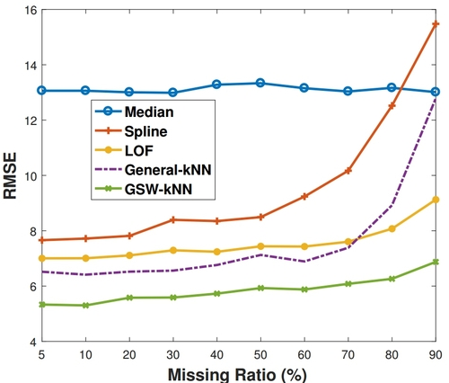

# GSW-kNN Imputation for Time Series
We propose a new imputation method for filling the missing values in time series.
The missing values are marked as `-1` in the example data file `Dodgers.data.csv`.
The data comes from [UCI Database](https://archive.ics.uci.edu/ml/datasets/Dodgers+Loop+Sensor) and we converted it into a .csv file for convenience.

# Usage
```bash
# default data, about 5% missing:
python2 impute-1-joblib-spark-public.py 2 1 0
# other missing ratio, e.g. 10%:
python2 impute-1-joblib-spark-public.py 2 1 0 0.1
```
Tip: 
About 2500 non-missing points (5%) are selected to test the accuracy.
To avoid the influence of selected points on the real-missing data, only 1 point is used in each config, it will take hours to run. 
Spark or multi-server config is suggested. 
If 4 servers are used, the following 4 commands should be excuted on each of the 4 servers respectively:
```sh
python2 impute-1-joblib-spark-public.py 2 4 0
python2 impute-1-joblib-spark-public.py 2 4 1
python2 impute-1-joblib-spark-public.py 2 4 2
python2 impute-1-joblib-spark-public.py 2 4 3
```

# Results
Our proposed GSW-kNN is 18% to 46% better when being compared to general
kNN, 34% more accurate than benchmarking methods, and it is still robust even if the missing ratio increases to 90%.



# Citation Request
**[IEEE Format]** B. Sun, L. Ma, W. Cheng, W. Wen, P. Goswami, and G. Bai, “An Improved k-Nearest Neighbours Method for Traffic Time Series Imputation,” in Chinese Automation Congress (CAC), Jinan, China, 2017.

**[AAA Format]** Bin Sun, Liyao Ma, Wei Cheng, et al. 2017. An Improved K-Nearest Neighbours Method for Traffic Time Series Imputation. In Chinese Automation Congress (CAC). Jinan, China: IEEE.

**[Bibtex]:**

```tex
@inproceedings{sun2017improved,
  location = {{Jinan, China}},
  title = {An {{Improved}} K-{{Nearest Neighbours Method}} for {{Traffic Time Series Imputation}}},
  abstract = {Intelligent transportation systems (ITS) are becoming more and more effective, benefiting from big data. Despite this, missing data is a problem that prevents many prediction algorithms in ITS from working effectively. Much work has been done to impute those missing data. Among different imputation methods, k-nearest neighbours (kNN) has shown excellent accuracy and efficiency. However, the general kNN is designed for matrix instead of time series so it lacks the usage of time series characteristics such as windows and weights that are gap-sensitive. This work introduces gap-sensitive windowed kNN (GSW-kNN) imputation for time series. The results show that GSW-kNN is 34\% more accurate than benchmarking methods, and it is still robust even if the missing ratio increases to 90\%.},
  eventtitle = {Chinese Automation Congress (CAC)},
  booktitle = {Chinese {{Automation Congress}} ({{CAC}})},
  publisher = {{IEEE}},
  author = {Sun, Bin and Ma, Liyao and Cheng, Wei and Wen, Wei and Goswami, Prashant and Bai, Guohua},
  date = {2017-10},
  keywords = {Traffic Time Series, Gap-Sensitive Windowed k-Nearest Neighbours (GSW-kNN), Missing Data Imputation}
}
```

# Paper
The paper is available on [Diva](http://urn.kb.se/resolve?urn=urn:nbn:se:bth-15209) and [ResearchGate](https://www.researchgate.net/publication/320087317_An_Improved_k-Nearest_Neighbours_Method_for_Traffic_Time_Series_Imputation).

